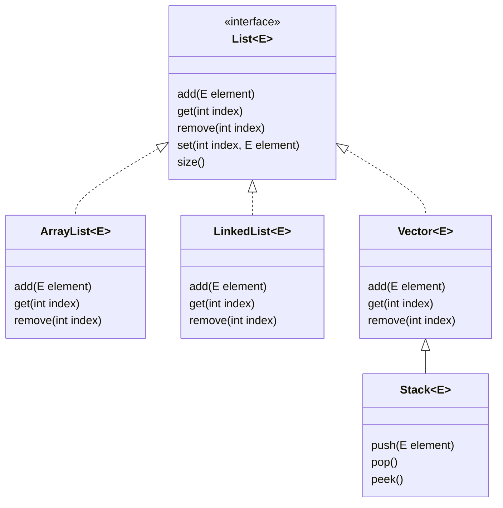

**Collection**
-----------------
-> Collection is nothing but handle group of Object using Collection Interface & Individual Object using map interface .
-> Only Objects are moving in the network .
-> Collection provides a class Library to handle group of Objects.
-> it is implemented by using Java.util.
-> All the Operation's we perform on data such as searching,sorting,insertion,deletion we can perform that  by using Collection   Interface.
-> So simply collection is Single Unit of Object .

Sub interfaces 
---------------
List(Accept duplicate ) 
Set (not accept duplicate)
Queue(sort the element based on some order i,e fifo)

Collection is an Interface available in java.util from 1.2 & Collections is a class available from 1.2 in Java.util package 

**Methods of Collection**
--------------------------
public Boolean add (Element e)-> to add element to Collection.
public boolean addAll(Collection c)-> to insert specified  collection element to  the existing Collection
public boolean retainAll(Collection c) -> to retain Collection element from existing Collection
public boolean removeAll(Collection c) -> to remove Collection element from existing Collection .
public boolean remove(Object o) -> Remove element from the Collection based on based on Object .
public int size()-> To know the total size of the Collection
public void clear()-> To Clear all the elements from the Collection at a once  .

All the methods of Collection applicable to sub interfaces of Collection  List ,set ,queue .

 **Methods of List** 
---------------------
public boolean isEmpty()-> To Check whether list is empty or not
public void clear()-> To Clear all the element from the list,Basically became empty.
public int size()-> To get the total size
public void add (int index,Object o)-> To add element to list based on index position.
public void addAll(int index,Collection c)-> To add collection element to the list based on index position 
public Object get(int index)-> To retrive element based on index position .
public Object set(int index,Object o)->To replace or Override element in the existing Collection
public Object remove(int index)-> To remove element from collection based on index.
public boolean remove(Object o)-> Remove Collection Object from the list.
public int indexOf()-> To know the  index position of element
public int lastIndexOf()->To know the last index position of element. 
public Iterator iterator()-> To iterate Collection element in forward direction only
public ListIterator listIterator()-> To iterate Collection element in Forward & Backward direction 

**Enumeration**
----------------
Enumeration is an legacy interface available in java.util from 1.0
Used to retrive elements from collection one by one 
we can create the object of Enumeration by using elements() method of legacy Collection class.internally it uses annonymous inner class concept .

public Enumeration elements().

Enumeration intrface have 2 methods 
public boolean hasNext();-> it returns true if the Collection have more element.
public Object nextElement();-> it return's the collection Object because the return type is Object and move the Cursor to next line.
it will only work with legacy collection classes.

**Methods Of Collection**
----------------------------
1) public boolean add (Element e)-> it is used to add an item/element into the Collection.
2) public boolean addAll(Collection c )->it is used to insert specified collection element to the existing collection .
3) public boolean retainAll(Collection c)-> it is used to retain All the element from the existing Collection .
4) public boolean removeAll(Collection c)-> it is used to delete all the  element from the existing collection .
5) public boolean remove(Object o)-> it is used to delete an element from the collection based on Object .
6) public int size()-> it is used to find out the total size of the collection .
7) public void Clear()-> it is used to clear all the element from the collection at once .

All these methods of Collection interface is available to all the sub interfaces of Collection .ex->List,Set,Queue.

*List Interface*
-----------------
-> sub interface of Collection
    Avl from 1.2 
    java.util
    Internally array store the element based on index 
    Accept duplicate,null,homogeneous,heterogenous
    store in the form of Object 
    if we the store element without generic then Compilation Warning Unsafe Object 
    by using generic we can eliminate compilation warning.still can accept homogenous & heterogenous  
    Can perform sorting using Collect.sort(List list) Collection accept list as a parameter 
    Some of List Interface Classes are dynamically Growable ArrayList,Vector 

**Method of List Interface**
-----------------------------
Verify
------
public boolean isempty();

Clear the list
---------------
public void clear()

TotalSize
---------
public int size 

add element to the list 
-----------------------
public boolean add(int index,Collection c)
public boolean add (int index,Object o)

retrive
--------
public Object get(int index);

replace 
--------
public Object set(int index,Object o)

remove Based on index 
-----------------------
public Object remove(int index)
public Object remove (Object o)-> Override from Collection implemented by List

public int indexOf()
public int lastIndexOf()

public iterator iterator()
public ListIterator listIterator()

